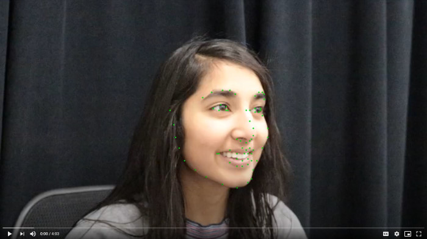
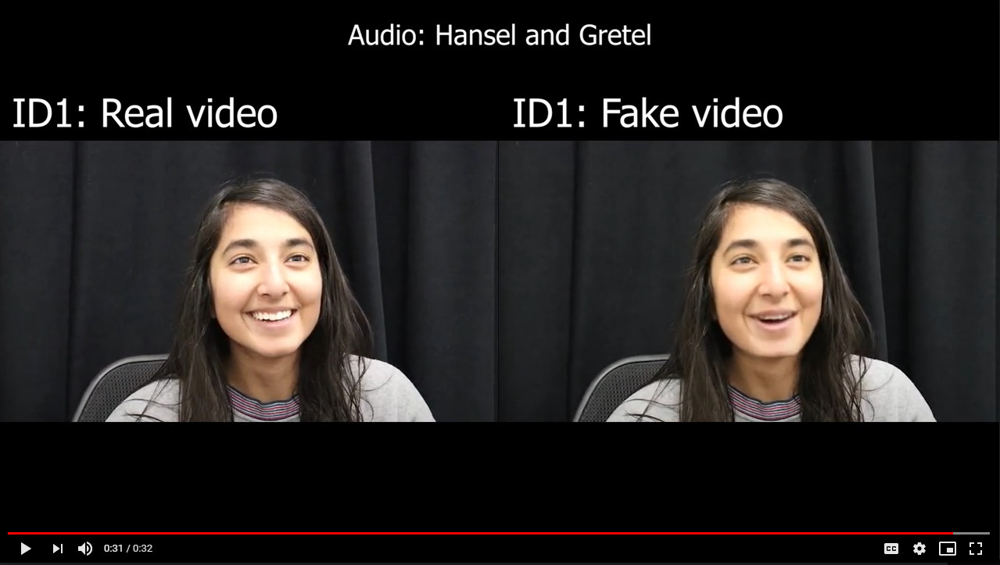

# Detect Deepfakes with Social Video Verification

*Harman Suri, Eleanor Tursman, James Tompkin*  
*Brown University*

Deepfakes can spread misinformation, defamation, andpropaganda by faking videos of public speakers. In a future where deepfakes are visually indistinguishable from real video, how will we detect them? Help build a social verification system where people group at events to capture corroborating smartphone video and verify the truth! We have built a dataset of fakes and non-fakes with tracked facial features, and we challenge you to design an algorithm to detect the faked videos. Starter code and baseline metrics included!

## Project Familiarization:

- Visit the [social video verification webpage](http://visual.cs.brown.edu/projects/social-video-verification-webpage/).
- Watch the [presentation video](https://youtu.be/b6gPMMjfRWA) to gain an idea of the problem and of our proposed solution.
- Look at the 'Data' section of the webpage to get an idea of the camera setup.
- More information about the technique is available in the [paper PDF](http://visual.cs.brown.edu/projects/social-video-verification-webpage/cvprw2020/CVPRW2020_Tursman_SocialVideoVerification.pdf).

  

## Setup

### Environment Setup

- Python 3
- `requirements.txt` - use this to build a Python Virtual Environment for the project

### Data Download

- Follow the instructions in `./data/data.txt` to extract the pre-extracted facial landmarks.
- The input video sequences and the faked sequences via [https://github.com/Rudrabha/LipGAN/tree/fully_pythonic](LipGAN) are available [here](https://repository.library.brown.edu/studio/collections/id_1006/) --- be warned, these are _large_ (5GB per person), and we recommend working with the pre-extracted facial landmarks.

Example video of the landmarks overlaid onto a participant: [here](https://drive.google.com/file/d/1Hq70t2CxvzlCXcKGE_SHrYDIplQS-yxP/view).  
Landmarks are shown as green dots.  

Example image of landmark index layout over the face.  
The data contains a subset of the 20 mouth landmarks [points 49-68] from the following 68 points :  
  
[Thank you to [www.geeksforgeeks.org](www.geeksforgeeks.org)]

Example video of real and fake sequences: [here](https://drive.google.com/file/d/1iiqGnVDwVOZzBeHh9YhCqPcld1915j3q/view)  

  

  

## Code

The starter code includes two files: 
- `full_sequence_exp.py` - detecting deep fakes using a whole video at once.
- `window_acc_exp.py` - detecting deep fakes using a 'sliding window' in time, to predict whether any short sequences of speech is a fake.

These files reproduce the full sequence and sliding window experiments from the paper. 

Both of these files expect the facial landmark ".mat" files to be included in the Data directory in a certain format. See the text file in the Data directory for exact naming conventions. 

_Note:_ The sliding window experiment takes a bit over an hour to run for each unique triple   (participant ID, small window size, threshold), so it might not be feasible to run over all the IDs. You may be able to translate some of the concepts from that code into your own experiments. This windowed accuracy experiment also has arguments to generate a window size vs. accuracy plot and ROC curve for a specific window size (as shown in the paper). You should include similar accuracy/ROC metrics (some graphical form preferred!) with your submission.

## Task

- Run the `full_sequence_exp.py` and generate results using our existing social deepfake detection method. You can see that it is successful about 70-80% of the time when one video is faked among a set of six videos. 
- Can you do better?

### Possible approaches:

- From the data, to see the motions. plot the 20 mouth facial landmarks, each as an (x,y) point, over time in an animation.
- Analyse the mouth landmarks via their positions and motions over time.
- To familiarize yourself with the setup, start with a simple method based on a distance threshold on the upper and lower lip distances --- the idea is to detect whether someone's mouth is open in one video view but closed in another video view.
- Try to extract spatio-temporal features from the data and classify it as fake or not fake.
- Try to cluster spatio-temporal features and group sets of videos into fakes or not fakes.
- ¿¿¿ Machine learning ???
- ¿¿¿ Deep learning ???
- ¿¿¿ GANs ???

### Submission

- Fork the repo.
- Work on your method.
- Use Hack@Home's Devpost system to submit your project.
- Deadline: Sunday 9th October 2020 at 2pm ET.

<!--
### Submission

- Fork the repo
- Work on your method
- Commit back a `submission.md` file which includes a written description of your approach, plus includes the output plots of your performance from `full_sequence_exp.py`.
- Submit your repo URL using [this Google form](https://docs.google.com/forms/d/e/1FAIpQLSe8VrQD_oPT5Od4wpM39Xg7VwDAXIs-JxJpBPqy9ba3y3JyuQ/viewform).
- Deadline: Sunday 9th October 2020 at 3pm ET
-->

### Release History

- 2020-10-09 Hack@Home 2020: First version.